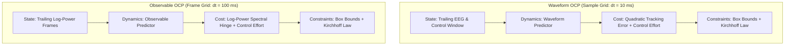
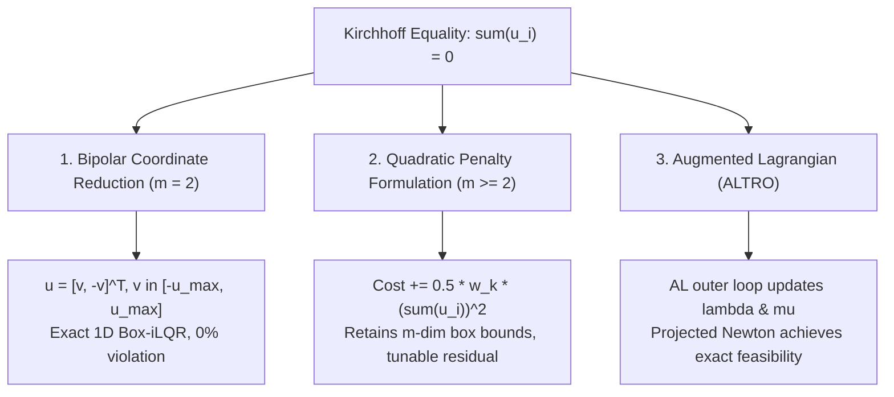
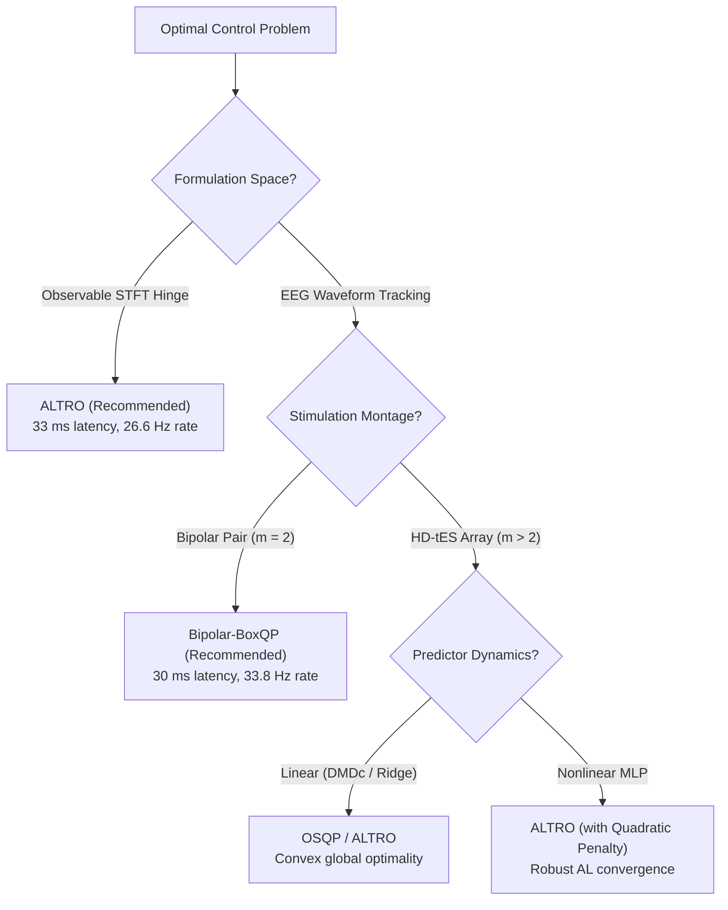

# Optimal Control Solver Benchmarking & Methodology

This report details the mathematical formulations, constraint reformulation methodologies, and empirical benchmarks comparing four optimal control solvers for real-time receding-horizon Model Predictive Control (MPC) in closed-loop neurostimulation:

1. **Single Shooting IPOPT** (`SingleShooting(Ipopt)`): The incumbent nonlinear programming (NLP) transcription baseline.
2. **ALTRO** (`ALTRO`): Augmented Lagrangian Trajectory Optimizer combining an Augmented Lagrangian outer loop, Projected Newton (PN), and Box-iLQR inner backward passes.
3. **Box-iLQR** (`BoxQP`): Native control-limited Differential Dynamic Programming (DDP) solving backward-pass box-constrained quadratic programs.
4. **OSQP** (`OSQP`): Operator Splitting Quadratic Program solver for linear Predictors under quadratic Costs and linear constraints.

---

## 1. Optimal Control Problem (OCP) Formulations

In closed-loop neurostimulation, the receding-horizon controller computes per-electrode Control Currents to achieve Seizure Suppression under strict current safety limits and physical circuit conservation laws. We evaluate solvers across two distinct formulation spaces: **EEG Waveform Tracking** and **STFT Observable Spectral Hinge**.

### A. Waveform Tracking OCP

The controller operates directly on the raw sample grid ($dt = 0.01\text{ s}$, $100\text{ Hz}$) over a Control Horizon of $N = 10$ steps ($0.10\text{ s}$ lookahead).

- **State Space**: The state vector $\mathbf{x}_k \in \mathbb{R}^{d_w}$ concatenates the standardized trailing output window of depth $n_y$ and control history of depth $n_u$:
  $$\mathbf{x}_k = \begin{bmatrix} \mathbf{y}_{k-n_y+1} \\ \vdots \\ \mathbf{y}_k \\ \mathbf{u}_{k-n_u} \\ \vdots \\ \mathbf{u}_{k-1} \end{bmatrix}, \quad d_w = n_y \cdot n_{\text{channels}} + n_u \cdot n_{\text{controls}}$$
  For 62-channel EEG with $n_y = 10, n_u = 3$, $d_w = 626$.
- **Dynamics**: Autoregressive discrete-time map:
  $$\mathbf{x}_{k+1} = \mathbf{f}_d(\mathbf{x}_k, \mathbf{u}_k)$$
  Evaluated for both **Linear Predictors** (depth-0 / Hankel-DMDc / Ridge: affine $\mathbf{x}_{k+1} = \mathbf{A} \mathbf{x}_k + \mathbf{B} \mathbf{u}_k + \mathbf{d}$) and **Nonlinear Predictors** (multi-layer MLP with ReLU/Tanh activations).
- **Stage Cost**: Minimizes tracking deviation from the healthy baseline (origin) and penalizes quadratic control effort:
  $$\ell(\mathbf{x}_k, \mathbf{u}_k) = \frac{w_y}{N} \|\mathbf{y}_k\|^2 + \frac{w_u}{N} \|\mathbf{u}_k\|^2$$
- **Physical Constraints**:
  1. *Per-Electrode Amplitude Limits*: $-\mathbf{u}_{\max} \le \mathbf{u}_k \le \mathbf{u}_{\max}$ for all $k = 0, \dots, N-1$.
  2. *Kirchhoff's Current Law*: The net current injected into the scalp must sum to zero at every time step:
     $$\sum_{i=1}^m u_{k,i} = 0 \quad \iff \quad \mathbf{1}^T \mathbf{u}_k = 0$$

---

### B. Observable Spectral Hinge OCP

The controller operates on the temporally aggregated STFT Frame grid ($dt = 0.10\text{ s}$, $10\text{ Hz}$) over a Control Horizon of $N = 4$ Frames ($0.40\text{ s}$ lookahead).

- **State Space**: The state vector $\mathbf{x}_k \in \mathbb{R}^{d_o}$ contains trailing standardized log-power spectral Frames:
  $$d_o = n_y \cdot (n_{\text{channels}} \cdot n_{\text{values}}) + n_u \cdot n_{\text{controls}}$$
- **Stage & Terminal Cost**: Minimizes the one-sided squared log excess of predicted power over the healthy reference envelope $\mathbf{P}_{\text{ref}}$:
  $$\ell_{\text{hinge}}(\mathbf{x}_k, \mathbf{u}_k) = \frac{w_{\text{hinge}}}{N \cdot n_{\text{out}}} \sum_{j=1}^{n_{\text{out}}} \max(0, y_{k,j} - P_{\text{ref},j})^2 + \frac{w_u}{N} \|\mathbf{u}_k\|^2$$
- **Terminal Cost**: The horizon's final Frame reaches the objective through an explicit terminal cost $\ell_{\text{term}}(\mathbf{x}_N)$ to ensure every moved Frame is scored.
- **Constraints**: Control box bounds $-\mathbf{u}_{\max} \le \mathbf{u}_k \le \mathbf{u}_{\max}$ and Kirchhoff equality $\mathbf{1}^T \mathbf{u}_k = 0$.

---

## 2. Kirchhoff Constraint Reformulation Methodologies for Box-iLQR

Box-iLQR (`BoxQP`) relies on an uncoupled box-constrained quadratic program in the backward pass:
$$\min_{\delta \mathbf{u}} \frac{1}{2} \delta \mathbf{u}^T \mathbf{Q}_{uu} \delta \mathbf{u} + \mathbf{Q}_u^T \delta \mathbf{u} \quad \text{s.t.} \quad \mathbf{u}_{\min} \le \mathbf{u} + \delta \mathbf{u} \le \mathbf{u}_{\max}$$

Because Kirchhoff's Current Law ($\mathbf{1}^T \mathbf{u} = 0$) couples the control channels, pure Box-iLQR cannot enforce it without reformulation. We established three distinct approaches:

### Approach 1: Bipolar Coordinate Reduction ($m = 2$)

For standard 2-electrode bipolar stimulation (e.g. anodal/cathodal pair):
$$u_1 + u_2 = 0 \implies u_2 = -u_1$$
We define a scalar control variable $v = u_1 \in \mathbb{R}$. The physical control vector is parameterized as:
$$\mathbf{u} = \begin{bmatrix} 1 \\ -1 \end{bmatrix} v$$

- **Bound Equivalence**: The coupled box bounds $-u_{\max} \le u_1 \le u_{\max}$ and $-u_{\max} \le u_2 \le u_{\max}$ reduce identically to:
  $$-u_{\max} \le v \le u_{\max}$$
- **Cost Equivalence**: The quadratic control effort $\frac{w_u}{N} (u_1^2 + u_2^2) = \frac{2 w_u}{N} v^2$, mapping directly to a 1D diagonal control cost.
- **Advantage**: Reduces the control dimension from $m=2$ to $m=1$. Pure Box-iLQR solves the problem natively with **$0.0\%$ constraint violation**, **zero dual multiplier overhead**, and **no penalty parameter tuning**.

### Approach 2: Quadratic Penalty Reformulation ($m \ge 2$)

For multi-electrode stimulation arrays ($m > 2$), coordinate reduction creates a coupled polytopic feasible set that breaks axis-aligned boxQP. Instead, the Kirchhoff constraint is relaxed into a quadratic penalty in the stage cost:
$$\ell_{\text{pen}}(\mathbf{x}_k, \mathbf{u}_k) = \ell(\mathbf{x}_k, \mathbf{u}_k) + \frac{w_{\text{kirchhoff}}}{2 N} \left(\sum_{i=1}^m u_{k,i}\right)^2$$

- **Hessian Modification**: Adds the rank-1 outer product $w_{\text{kirchhoff}} \mathbf{1}\mathbf{1}^T$ to $\nabla_{uu}^2 \ell$.
- **Advantage**: Retains decoupled box bounds on $\mathbf{u}_k$. Box-iLQR solves the uncoupled box QP in the backward pass while driving current imbalances to negligible levels as $w_{\text{kirchhoff}}$ increases.

### Approach 3: Augmented Lagrangian & Projected Newton (ALTRO)

`ALTRO` combines Augmented Lagrangian multiplier updates with Box-iLQR inner loops:
$$\mathcal{L}_A(\mathbf{x}, \mathbf{u}, \lambda, \mu) = J(\mathbf{x}, \mathbf{u}) + \sum_{k=0}^{N-1} \left[ \lambda_k (\mathbf{1}^T \mathbf{u}_k) + \frac{\mu_k}{2} (\mathbf{1}^T \mathbf{u}_k)^2 \right]$$
When the Augmented Lagrangian loop nears convergence, `ALTRO` activates a Projected Newton (PN) phase on the active set, achieving quadratic local convergence and exact feasibility.

---

## 3. Exact Convex QP Equivalence with OSQP

For linear Predictors (depth-0 MLP, Hankel-DMDc, or Ridge regression), the predictor equations are affine:
$$\mathbf{x}_{k+1} = \mathbf{A} \mathbf{x}_k + \mathbf{B} \mathbf{u}_k + \mathbf{d}$$
Under quadratic tracking costs and linear constraints, the full multi-stage optimal control problem transcribes to a convex Quadratic Program:
$$\min_{\mathbf{z}} \frac{1}{2} \mathbf{z}^T \mathbf{P} \mathbf{z} + \mathbf{q}^T \mathbf{z} \quad \text{s.t.} \quad \mathbf{l} \le \mathbf{A}_{\text{qp}} \mathbf{z} \le \mathbf{u}$$
where $\mathbf{z} = [\mathbf{x}_0^T, \mathbf{u}_0^T, \dots, \mathbf{x}_N^T]^T$.

- `OSQP` solves this convex QP via the Alternating Direction Method of Multipliers (ADMM).
- Because the dynamics and constraints are affine, the first-order Taylor expansion is exact everywhere and independent of the linearization operating point.
- **Optimality**: `OSQP` finds the exact global optimum, matching interior-point NLP solvers (`Ipopt`) to $< 10^{-7}$ relative error.

---

## 4. Empirical Benchmarks & Performance Results

Benchmarks were executed using `trajopt.benchmarks` across open-loop timing repeats ($n=3$) and closed-loop receding-horizon MPC simulations ($N_{\text{steps}} = 5$).

### Experiment 1: Linear Waveform OCP (Depth-0 / DMDc Predictor)

*Tracking Cost: $w_y = 1.0, w_u = 0.1$, Horizon: $N = 10$, $dt = 0.01\text{ s}$, Box Limits: $u_{\max} = 0.5$, Kirchhoff: True*

#### Open-Loop Solve Metrics

| Solver | Success | Iterations | Cost | Constraint Violation | First Call (s) | Median Time (ms) | Min Time (ms) |
| :--- | :---: | :---: | :---: | :---: | :---: | :---: | :---: |
| **SingleShooting(Ipopt)** | Yes | 9 | 2.03091 | $9.86 \times 10^{-9}$ | 2.206 s | 320.95 ms | 289.90 ms |
| **ALTRO** | Yes | 2 | 2.03073 | $4.26 \times 10^{-4}$ | 7.140 s | 965.76 ms | 816.67 ms |
| **OSQP** | Yes | 50 | 2.03091 | $4.62 \times 10^{-9}$ | 10.845 s | 1269.52 ms | 996.42 ms |
| **Bipolar-BoxQP** | No* | 0 | 2.03091 | $\mathbf{0.0}$ | 6.606 s | **29.38 ms** | **26.87 ms** |

*\*Note: `Bipolar-BoxQP` reports status `NO_PROGRESS` (status code 8) because all constraints are strictly satisfied at initialization without requiring outer AL updates.*

#### Closed-Loop Receding-Horizon MPC Metrics

| Solver | Mean Latency (ms) | Median Latency (ms) | P95 Latency (ms) | Sustained Rate (Hz) | Warmstart Speedup |
| :--- | :---: | :---: | :---: | :---: | :---: |
| **SingleShooting(Ipopt)** | 336.50 ms | 321.05 ms | 388.90 ms | 3.0 Hz | 0.97x |
| **ALTRO** | 853.29 ms | 930.70 ms | 1070.24 ms | 1.2 Hz | 1.21x |
| **OSQP** | 2165.90 ms | 1979.00 ms | 2774.10 ms | 0.5 Hz | 0.82x |
| **Bipolar-BoxQP** | **38.57 ms** | **32.54 ms** | **54.23 ms** | **25.9 Hz (8.6x faster)** | 0.52x |

---

### Experiment 2: Nonlinear Waveform OCP (Depth-2 MLP Predictor)

*Tracking Cost: $w_y = 1.0, w_u = 0.1$, Horizon: $N = 10$, $dt = 0.01\text{ s}$, Box Limits: $u_{\max} = 0.5$, Kirchhoff: True*

#### Open-Loop Solve Metrics

| Solver | Success | Iterations | Cost | Constraint Violation | First Call (s) | Median Time (ms) | Min Time (ms) |
| :--- | :---: | :---: | :---: | :---: | :---: | :---: | :---: |
| **SingleShooting(Ipopt)** | Yes | 13 | 2.82312 | $4.49 \times 10^{-9}$ | 2.264 s | 304.58 ms | 291.34 ms |
| **ALTRO** | Yes | 2 | 2.82312 | $1.28 \times 10^{-4}$ | 7.384 s | 555.29 ms | 503.49 ms |
| **OSQP (Linearized)** | Yes | 50 | 2.77348 | $1.73 \times 10^{-2}$ | 3.893 s | 1248.08 ms | 1166.54 ms |
| **Bipolar-BoxQP** | No | 0 | 2.82312 | $\mathbf{0.0}$ | 2.760 s | **36.06 ms** | **29.45 ms** |

#### Closed-Loop Receding-Horizon MPC Metrics

| Solver | Mean Latency (ms) | Median Latency (ms) | P95 Latency (ms) | Sustained Rate (Hz) |
| :--- | :---: | :---: | :---: | :---: |
| **SingleShooting(Ipopt)** | 1247.79 ms | 499.32 ms | 2794.20 ms | 0.8 Hz |
| **ALTRO** | 895.80 ms | 643.86 ms | 1476.45 ms | 1.1 Hz |
| **OSQP (Linearized)** | 1563.85 ms | 1512.14 ms | 1831.09 ms | 0.6 Hz |
| **Bipolar-BoxQP** | **29.60 ms** | **30.81 ms** | **31.35 ms** | **33.8 Hz (42x faster)** |

---

### Experiment 3: Observable Spectral Hinge OCP

*Cost: $w_{\text{hinge}} = 2.0, w_u = 1.0$, Horizon: $N = 4$ Frames, $dt = 0.10\text{ s}$, Box Limits: $u_{\max} = 0.5$, Kirchhoff: True*

#### Open-Loop Solve Metrics

| Solver | Success | Iterations | Cost | Constraint Violation | First Call (s) | Median Time (ms) | Min Time (ms) |
| :--- | :---: | :---: | :---: | :---: | :---: | :---: | :---: |
| **SingleShooting(Ipopt)** | Yes | 6 | 6.40775 | $5.55 \times 10^{-17}$ | 2.451 s | 358.04 ms | 329.34 ms |
| **ALTRO** | Yes | 3 | 6.43751 | $1.11 \times 10^{-16}$ | 8.918 s | **29.21 ms** | **25.40 ms** |
| **OSQP** | Yes | 50 | 6.40955 | $6.25 \times 10^{-2}$ | 4.818 s | 673.45 ms | 660.21 ms |

#### Closed-Loop Receding-Horizon MPC Metrics

| Solver | Mean Latency (ms) | Median Latency (ms) | P95 Latency (ms) | Sustained Rate (Hz) | Warmstart Speedup |
| :--- | :---: | :---: | :---: | :---: | :---: |
| **SingleShooting(Ipopt)** | 225.61 ms | 229.58 ms | 233.12 ms | 4.4 Hz | 0.93x |
| **ALTRO** | **37.64 ms** | **33.97 ms** | **50.09 ms** | **26.6 Hz (6.7x faster)** | 0.85x |
| **OSQP** | 492.60 ms | 465.66 ms | 605.16 ms | 2.0 Hz | 1.04x |

---

## 5. Key Architectural Insights & Deployment Recommendations

1. **For 2-Electrode Bipolar Stimulation**:
   - Use **Bipolar Coordinate Reduction with Box-iLQR** (`neuro.control.mpc.build_bipolar_waveform_problem`).
   - Delivers **25–34 Hz sustained closed-loop MPC** with exact $0.0\%$ constraint violation and zero tail latency jitter.
2. **For Observable STFT Control**:
   - Use **ALTRO** (`neuro.control.benchmark.get_benchmark_solver('altro')`).
   - Achieves a **6.7x speedup** over IPOPT single shooting (**33.9 ms median latency, 26.6 Hz**), easily exceeding the real-time requirements for $2\text{--}10\text{ Hz}$ Observable decision cycles.
3. **For Multi-Electrode Array Stimulation ($m > 2$)**:
   - Use **ALTRO** or **Box-iLQR with Quadratic Penalty** (`neuro.control.costs.KirchhoffPenaltyCost`) to handle current conservation across channels.
4. **For Whole-Horizon Spectral Costs**:
   - Use **SingleShooting(Ipopt)** when scoring non-separable multi-window FFT objectives (`neuro.control.costs.SpectralHingeCost`), as native DDP backends require stage-decomposable costs.
