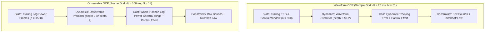
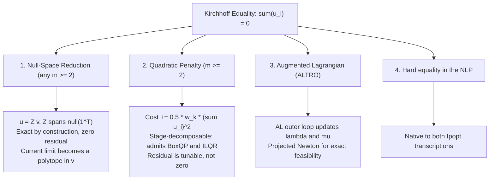

# Choosing an Optimal Control Solver per Predictor

This report exists to answer one question: **for a given trained Predictor and Cost, which solver should the experiments use?** It is not a real-time feasibility study — no per-step deadline is assumed anywhere below, and wall time is reported as the price of a solve rather than as a pass/fail criterion. The decision columns are *success*, *cost*, and *constraint violation*; time is a tiebreak.

The candidates, all reached through `neuro.control.benchmark.get_benchmark_solver`:

1. **Single Shooting IPOPT** (`SingleShooting(Ipopt)`) — interior-point NLP on the condensed transcription, eliminating the states and optimizing the control trajectory alone.
2. **Multiple Shooting IPOPT** (`Ipopt(MultipleShooting)`) — the same interior-point solver on the direct transcription, keeping the states as decision variables under defect equality constraints.
3. **ALTRO** — Augmented Lagrangian outer loop over Box-iLQR inner passes, with a Projected Newton phase for exact feasibility.
4. **Box-iLQR** (`BoxQP`) — control-limited Differential Dynamic Programming, solving a box-constrained QP per knot in the backward pass.
5. **iLQR** (`ILQR`) — the same DDP recursion with no constraint handling at all, the unconstrained reference point.
6. **OSQP** — ADMM on a single convex subproblem built about the Operating Point.

The two structural facts that decide most of the outcomes are established in §3 and §4 before any timing appears: **how each solver treats a nonlinear Predictor**, and **which solvers can see a whole-horizon Cost at all**. Several rows are disqualified on those grounds regardless of how fast they run.

---

## 1. Optimal Control Problem (OCP) Formulations

The receding-horizon controller computes per-electrode Control Currents under current safety limits and Kirchhoff's Current Law. Two formulation spaces are evaluated: **EEG Waveform Tracking** and **STFT Observable Spectral Hinge**. Both are benchmarked on the deployed artifacts at a **1 s Control Horizon**, on each Predictor's own grid.

### A. Waveform Tracking OCP

Artifact `artifacts/cmp_waveform_mlp_1p5s` — softplus MLP, `depth = 2`, `hidden = 128`, 62 channels, 3 electrodes, `dt = 0.02 s`. The 1 s Control Horizon is `horizon = 50`, which trajopt carries as $N = 51$ knot points, matching `configs/simulation/mse02_psd_mpc.yaml`.

- **State Space**: $\mathbf{x}_k \in \mathbb{R}^{d_w}$ concatenates the standardized trailing output window of depth $n_y$ and the control history of depth $n_u$:
  $$\mathbf{x}_k = \begin{bmatrix} \mathbf{y}_{k-n_y+1} \\ \vdots \\ \mathbf{y}_k \\ \mathbf{u}_{k-n_u} \\ \vdots \\ \mathbf{u}_{k-1} \end{bmatrix}, \quad d_w = n_y \cdot n_{\text{channels}} + n_u \cdot n_{\text{controls}}$$
  With $n_y = 15$, $n_u = 10$, 62 channels and 3 electrodes: $d_w = 15 \cdot 62 + 10 \cdot 3 = \mathbf{960}$.
- **Dynamics**: the autoregressive discrete-time map $\mathbf{x}_{k+1} = \mathbf{f}_d(\mathbf{x}_k, \mathbf{u}_k)$.
- **Stage Cost**: $\ell(\mathbf{x}_k, \mathbf{u}_k) = \frac{w_y}{N}\|\mathbf{y}_k\|^2 + \frac{w_u}{N}\|\mathbf{u}_k\|^2$, benchmarked at $w_y = 1.0$, $w_u = 10.0$.
- **Constraints**: per-electrode limits $-u_{\max} \le \mathbf{u}_k \le u_{\max}$ at $u_{\max} = 2.0$, and Kirchhoff's Current Law $\mathbf{1}^T \mathbf{u}_k = 0$.

### B. Observable Spectral Hinge OCP

Artifacts `artifacts/cmp_observable_dmd_hop5` (`depth = 0`, hence affine) and `artifacts/cmp_observable_mlp_hop5` (`depth = 2`, `hidden = 512`), both `n_y = 1`, `n_u = 10`, `n_outputs = 1550`, `dt = 0.1 s`, STFT geometry `n_segment = 50`, `n_hop = 5`. The 1 s Control Horizon is `horizon = 10`, i.e. $N = 11$ Frames.

- **State Space**: $d_o = n_y \cdot n_{\text{outputs}} + n_u \cdot n_{\text{controls}} = 1550 + 30 = \mathbf{1580}$.
- **Cost**: the one-sided squared log excess of predicted power over the healthy envelope `data/healthy_psd_hop5.npz`, at $w_{\text{hinge}} = 10.0$, $w_u = 10.0$. Critically this is a **whole-horizon functional**, not a stage cost — see §4.
- **Constraints**: as above, $u_{\max} = 2.0$ and $\mathbf{1}^T\mathbf{u}_k = 0$.

---

## 2. Transcription and the Decision-Variable Count

The two Ipopt rows differ only in transcription, and that difference is the single largest effect in this report. Single shooting eliminates the states by rollout, so its Primal Vector is the control trajectory alone and **does not grow with the Predictor's trailing window**. The direct transcription keeps every state as a decision variable and adds a defect equality row per interval:

| | decision variables | defect rows |
| :--- | :--- | :--- |
| Single shooting | $(N-1)\,m$ | — |
| Multiple shooting | $N n + (N-1)\,m$ | $(N-1)\,n$ |

Because these Predictors' state is a trailing window rather than a physical configuration, $n$ is enormous relative to $m$, and the gap is not a constant factor:

| OCP | $N$ | $n$ | $m$ | SS vars | MS vars | MS defect rows |
| :--- | :---: | :---: | :---: | :---: | :---: | :---: |
| Waveform, 1 s | 51 | 960 | 3 | **150** | **49,110** | 48,000 |
| Observable, 1 s | 11 | 1580 | 3 | **30** | **17,410** | 15,800 |

This is the correction that invalidates any benchmark run on toy-scale stand-in checkpoints: on a small synthetic model the two transcriptions differ by roughly an order of magnitude, and at deployment scale they differ by nearly three. A comparison of transcriptions is only meaningful at the real state dimension.

---

## 3. What the Solvers Do With a Nonlinear Predictor

A recurring confusion is whether the DDP backends "linearize" in the same sense OSQP does. They do not, and the distinction decides which rows are trustworthy on the depth-2 Predictors.

### Box-iLQR / ALTRO: local, refreshed every iteration

`BoxQP` is control-limited DDP. The "QP" names the **per-knot backward-pass subproblem in $\delta\mathbf{u}$**, not a quadratic model of the whole problem:
$$\min_{\delta \mathbf{u}} \tfrac{1}{2} \delta \mathbf{u}^T \mathbf{Q}_{uu} \delta \mathbf{u} + \mathbf{Q}_u^T \delta \mathbf{u} \quad \text{s.t.} \quad \mathbf{u}_{\min} \le \mathbf{u} + \delta \mathbf{u} \le \mathbf{u}_{\max}$$
Each iteration re-expands the dynamics and cost about the *current* trajectory, solves the box QP per knot by projected Newton with clamped rows masked out, and then performs a **nonlinear closed-loop forward rollout** $\mathbf{u}_k = \bar{\mathbf{u}}_k + \mathbf{K}_k \delta\mathbf{x}_k + \alpha \mathbf{d}_k$ through the true $\mathbf{f}_d$, with Armijo backtracking on $\alpha$. The expansion is therefore local *and refreshed*, and the iteration converges to a local optimum of the genuine nonlinear problem.

Two consequences: the box bounds hold **by construction** through clamping in the forward rollout, which is why the DDP rows report violations at the $10^{-15}$ level rather than at a solver tolerance; and nothing about the Predictor's nonlinearity is approximated away.

### OSQP: one shot, about the Operating Point

`OSQP` builds a single convex subproblem: it linearizes the dynamics and takes the cost to second order **once**, about the Operating Point, then solves that by ADMM. `trajopt` marks it `_LINEARIZING` — and pointedly does *not* mark `BoxQP` — and it emits a `UserWarning` on every solve saying so.

The approximation is exact, and the answer the true optimum, only when the dynamics are affine *and* the cost quadratic *and* the constraints linear. On a `depth = 0` Predictor under the quadratic tracking cost all three hold and OSQP is exact. On a `depth = 2` Predictor none of that is guaranteed, and the size of the resulting error is an empirical question answered in §6, not a tolerance.

---

## 4. Which Solvers Can See the Cost At All

This constraint is sharper than any timing result and disqualifies solvers outright.

`neuro.control.costs.SpectralHingeCost` is a **whole-horizon functional**. Its FFT window $m$ spans Frames $y_{m \cdot \text{hop}} \ldots y_{m \cdot \text{hop} + \text{window} - 1}$, and `window` typically exceeds the Predictor's history depth, so **no single knot holds enough history to score it**. The class resolves this by splitting its interface:

- `stage_costs(X, U, t)` decodes the Frames out of the whole stage trajectory and computes the exact windowed hinge by FFT.
- `evaluate(x, u, t)` returns **`0` at any single knot** — deliberately, so that per-knot local expansions degrade to the quadratic/L1 remainder rather than mis-score the hinge.

Only two code paths in `trajopt` call `stage_costs`: `transcription/single_shooting.py` and `transcription/transcription.py`. Everything downstream of those sees the exact hinge; everything else sees zero. OSQP's $\mathbf{P}$ and $\mathbf{q}$ are built by `quadratic_subproblem` from `eval_h`/`eval_grad_f` on the transcription objective, so it *does* see the hinge — to second order.

| Solver | Sees the spectral hinge? | Via |
| :--- | :---: | :--- |
| `SingleShooting(Ipopt)` | Yes, exactly | `stage_costs` |
| `Ipopt(MultipleShooting)` | Yes, exactly | `stage_costs` |
| `OSQP` | Yes, to second order about the Operating Point | `eval_h` / `eval_grad_f` |
| `ALTRO` | **No** | per-knot `evaluate` → 0 |
| `BoxQP` | **No** | per-knot `evaluate` → 0 |
| `ILQR` | **No** | per-knot `evaluate` → 0 |

**The DDP backends are structurally disqualified from the Observable OCP.** They do not solve a harder version of the problem, nor a slightly wrong one: they minimize $\frac{w_u}{N}\|\mathbf{u}_k\|^2$ subject to the constraints, which is minimized near $\mathbf{u} = \mathbf{0}$. They then terminate almost immediately — correctly, for the objective they can see — and the harness scores the resulting trajectory against the true cost. A near-instant `success=True` from `ALTRO` on the Observable OCP should be read as *the objective was invisible*, not as *the problem was easy*.

This bears directly on the deployed configuration, since `configs/simulation/observable_psd_mpc.yaml` selects `ALTRO`.

---

## 5. Kirchhoff's Law Decides the Eligible Solver Set

Kirchhoff's Current Law, $\mathbf{1}^T\mathbf{u}_k = 0$, couples the control channels, which a box-constrained backward pass cannot represent. The choice of reformulation is therefore also a choice of which solvers may compete, and the benchmark runs the Waveform OCP under **four** of them for exactly that reason.

### Approach 1: Null-Space Reduction ($m \ge 2$)

Kirchhoff's law is a single linear equality, so it leaves an $(m-1)$-dimensional null space. Parameterizing the currents over a basis $Z \in \mathbb{R}^{m \times (m-1)}$ of $\operatorname{null}(\mathbf{1}^T)$,

$$\mathbf{u}_k = Z\mathbf{v}_k, \qquad \mathbf{1}^T Z = \mathbf{0}$$

makes the constraint **identically true for every $\mathbf{v}$**. It leaves the constraint set entirely — no penalty weight, no multipliers, no equality row — and the control dimension drops by one. `neuro.control.mpc.kirchhoff_basis` returns the last-electrode elimination basis, which at $m = 3$ is

$$Z = \begin{bmatrix} 1 & 0 \\ 0 & 1 \\ -1 & -1 \end{bmatrix}, \qquad \mathbf{u} = [v_1, \; v_2, \; -v_1 - v_2]^T$$

and at $m = 2$ degenerates to the familiar bipolar pair $[v, -v]^T$. **An earlier version of this report called the reduction a bipolar special case unavailable at $m = 3$; that was wrong.**

The effort term stays exact but is no longer diagonal: $\|\mathbf{u}\|^2 = \mathbf{v}^T Z^T Z \mathbf{v}$, with $Z^TZ = \left[\begin{smallmatrix}2 & 1 \\ 1 & 2\end{smallmatrix}\right]$ at $m = 3$, condition number 3. `build_waveform_problem` therefore builds a dense `QuadraticCost` under reduction, so the objective scores exactly the same physical current as the unreduced problem does.

**What the reduction does not preserve is the box.** The per-electrode limit becomes

$$|v_1| \le u_{\max}, \quad |v_2| \le u_{\max}, \quad |v_1 + v_2| \le u_{\max}$$

which is a **hexagon** of area $3u_{\max}^2$, not a box. So the reduction does not remove a constraint — it converts an *equality* into an *inequality*. That is a good trade for an interior-point method, which is built for inequalities, and no help at all to a solver whose feasibility comes from elementwise clamping. Two treatments follow, and the benchmark runs both:

- **`reduce_kirchhoff = "polytope"`** carries the exact limit as $[Z; -Z]\mathbf{v} - u_{\max}\mathbf{1} \le \mathbf{0}$, a `LinearConstraint` over a `NegativeOrthant`. Ipopt and OSQP take it directly and nothing is given up.
- **`reduce_kirchhoff = "box"`** inscribes the largest centred box in the hexagon, $|v_i| \le u_{\max}/(m-1)$, of area $4u_{\max}^2/(m-1)^2$. At $m = 3$ that is **one third of the feasible set**, and it is the only form `BoxQP` and `ILQR` can accept. The elimination basis is also asymmetric here: electrode 3 keeps its full $\pm u_{\max}$ while 1 and 2 are halved.

At $m = 2$ the two coincide — the hexagon *is* the box — which is why the bipolar case looked free and generalized misleadingly.

### Approach 2: Quadratic Penalty ($m \ge 2$)

$$\ell_{\text{pen}}(\mathbf{x}_k, \mathbf{u}_k) = \ell(\mathbf{x}_k, \mathbf{u}_k) + \frac{w_{\text{kirchhoff}}}{2N}\left(\sum_{i=1}^m u_{k,i}\right)^2$$

This adds the rank-1 outer product $w_{\text{kirchhoff}}\mathbf{1}\mathbf{1}^T$ to $\nabla^2_{uu}\ell$ and leaves the box bounds decoupled, so it is the only form in which `BoxQP` and `ILQR` can attempt the multi-electrode Waveform OCP at all. The residual falls as $w_{\text{kirchhoff}}$ rises but never reaches zero, so the violation column must be read alongside the cost. Benchmarked at $w_{\text{kirchhoff}} = 10.0$.

### Approach 3: Augmented Lagrangian (ALTRO)

$$\mathcal{L}_A = J(\mathbf{x}, \mathbf{u}) + \sum_{k=0}^{N-1}\left[\lambda_k(\mathbf{1}^T\mathbf{u}_k) + \frac{\mu_k}{2}(\mathbf{1}^T\mathbf{u}_k)^2\right]$$

The AL outer loop drives $\lambda$ and $\mu$ until the Projected Newton phase can close the active set exactly. This buys exact feasibility on the equality without giving up the DDP inner loop — at a memory cost documented in §6.

### Approach 4: Hard equality in the NLP

Both Ipopt transcriptions take $\mathbf{1}^T\mathbf{u}_k = 0$ directly as a constraint row, with no reformulation.

---

## 6. Empirical Results

Produced by `uv run python scripts/benchmark_solvers.py --repeats 2 --steps 3` on the artifacts and horizons of §1.

**Method notes.**

- Every Ipopt solve is capped at **120 s CPU** (`neuro.control.benchmark._IPOPT_MAX_CPU_SECONDS`). This bounds the benchmark's own runtime, not a control deadline: uncapped, a non-convergent 49,110-variable transcription runs to `max_iter = 300`, hours per solve. A row that hits the cap reports the iteration count it reached, which is what says whether it was ever close.
- Ipopt uses `hessian_approximation = "limited-memory"`; an exact Hessian is not tractable at these dimensions.
- A solver that raises is logged and dropped from its table rather than aborting the suite (`compare_open_loop` / `compare_closed_loop`). An absent row is a failure, and the log names it.
- Costs are always recomputed by the harness against the true objective, so a solver that optimized an approximation is scored on the real problem rather than on its own model of it.

**Read the cost column only through the violation column.** This is not a caveat, it is the main hazard in every table below. Three of the four experiments have a row whose cost is the lowest present and whose solution is not a solution. An interior-point method approaches feasibility as it converges, so an early-stopped iterate scores a low objective precisely *because* it has not yet paid for its constraints.

### 6.1 Waveform OCP — Kirchhoff as a hard equality

| Solver | Success | Iterations | Cost | Constraint Violation | First Call (s) | Median (ms) |
| :--- | :---: | :---: | ---: | ---: | ---: | ---: |
| **SingleShooting(Ipopt)** | No | 45 | 6303.11196 | $2.00 \times 10^{-8}$ | 5.67 | 3478.50 |
| **Ipopt(MultipleShooting)** | No | 3 | 575.25567 | $2.23 \times 10^{-1}$ | 131.72 | 131011.70 |
| **OSQP** | Yes | 1100 | 1150227.12416 | $2.29 \times 10^{1}$ | 770.28 | 311279.48 |
| **ALTRO** | *dropped* — `RESOURCE_EXHAUSTED`, 127.8 GB | | | | | |

| Solver | Mean (ms) | Median (ms) | P95 (ms) | P99 (ms) | Warmstart Speedup |
| :--- | ---: | ---: | ---: | ---: | :---: |
| **SingleShooting(Ipopt)** | 5223.41 | 5573.50 | 5957.32 | 5991.44 | 1.28x |
| **Ipopt(MultipleShooting)** | 133639.27 | 136480.21 | 138208.96 | 138362.62 | 0.89x |
| **OSQP** | 186331.11 | 86453.78 | 357712.09 | 381823.94 | 1.22x |

Multiple shooting's cost of 575 is roughly a tenth of single shooting's 6303 and means nothing: it is evaluated at a point violating its own constraints by $0.22$. This is the transcription difference of §2 surfacing where it counts. **Single shooting's iterates are dynamically feasible by construction** — the states come from a rollout, so only the Kirchhoff row can be violated, hence $2 \times 10^{-8}$. Multiple shooting's states are free variables, so an unconverged iterate satisfies neither the defect rows nor Kirchhoff and its trajectory is not a trajectory. At 3 iterations on 49,110 variables it is nowhere near the feasible manifold, and the shifted warm start actively hurts it ($0.89\times$).

This makes tolerance to early stopping a first-class selection criterion rather than a benchmark artifact: an interrupted single-shooting solve is deployable, an interrupted multiple-shooting solve is not.

OSQP's violation of $22.9$ puts a number on §3. A single linearization of a depth-2 MLP across a 1 s horizon is not a usable approximation of it.

### 6.2 Waveform OCP — Kirchhoff as a quadratic penalty ($w_{\text{kirchhoff}} = 10$)

| Solver | Success | Iterations | Cost | Constraint Violation | First Call (s) | Median (ms) |
| :--- | :---: | :---: | ---: | ---: | ---: | ---: |
| **SingleShooting(Ipopt)** | **Yes** | 141 | 6061.34384 | $2.00 \times 10^{-8}$ | 5.90 | 4455.50 |
| **Ipopt(MultipleShooting)** | No | 2 | 306.27299 | $2.12 \times 10^{-1}$ | 136.32 | 135562.31 |
| **OSQP** | Yes | 125 | 1094718.24661 | $2.24 \times 10^{1}$ | 460.46 | 266892.48 |
| **BoxQP** | **Yes** | **1** | **6061.34385** | $\mathbf{5.55 \times 10^{-15}}$ | 35.91 | 36591.88 |
| **ILQR** | Yes | 25 | 5691.97100 | $5.52 \times 10^{0}$ | 64.20 | 64383.17 |
| **ALTRO** | *dropped* — `RESOURCE_EXHAUSTED`, 127.8 GB | | | | | |

| Solver | Mean (ms) | Median (ms) | P95 (ms) | P99 (ms) | Warmstart Speedup |
| :--- | ---: | ---: | ---: | ---: | :---: |
| **SingleShooting(Ipopt)** | 3506.36 | 3454.48 | 3655.55 | 3673.43 | 0.97x |
| **Ipopt(MultipleShooting)** | 134283.89 | 134916.58 | 138402.33 | 138712.17 | 0.93x |
| **OSQP** | 289134.48 | 217844.99 | 416350.44 | 433995.37 | 2.85x |
| **BoxQP** | 16413.76 | 16811.12 | 17726.25 | 17807.60 | 1.30x |
| **ILQR** | 12947.26 | 11791.93 | 15046.65 | 15335.96 | 79.21x |

Two results here carry the report.

**Softening Kirchhoff to a penalty is what makes the Waveform OCP solvable.** Single shooting goes from `No` at 45 iterations to `Yes` at 141. The hard equality, not the state dimension, was what stalled it. Read that sentence narrowly, though: §6.5 shows the penalty at $w = 10$ buys the `Yes` by abandoning current balance, so what is solvable here is a different problem, not this one made easier.

**`BoxQP` reaches the same optimum as single shooting to nine significant figures** — $6061.34385$ against $6061.34384$ — with a violation seven orders of magnitude smaller, in **one iteration**. This is the §3 argument confirmed empirically rather than by code reading: the DDP backend converges to a genuine local optimum of the nonlinear problem, and its bounds hold by construction rather than to a tolerance. It pays $36.6$ s against single shooting's $4.5$ s, so between these two the trade is feasibility against wall time, not optimality.

`ILQR` behaves exactly as an unconstrained reference should: it posts the lowest honest-looking cost, $5691.97$, by **exceeding $u_{\max}$** — a bound violation of $5.52$. Its $79\times$ warm-start speedup is the largest number in the report and is attached to an infeasible point.

Note that the violation column means something different in this table: with Kirchhoff moved into the cost it no longer measures current imbalance at all, only the box bounds. The imbalance the penalty actually leaves is measured separately in §6.5.

### 6.3 Observable OCP — linear Predictor (`depth = 0`, DMD)

| Solver | Success | Iterations | Cost | Constraint Violation | First Call (s) | Median (ms) |
| :--- | :---: | :---: | ---: | ---: | ---: | ---: |
| **SingleShooting(Ipopt)** | Yes | 4 | **32.84224** | $4.22 \times 10^{-15}$ | 2.59 | 1025.32 |
| **Ipopt(MultipleShooting)** | No | 2 | 33.38349 | $3.22 \times 10^{-15}$ | 125.28 | 121659.29 |
| **ALTRO** | Yes | 1 | 32.87668 | $5.16 \times 10^{-13}$ | 156.85 | 148235.16 |
| **OSQP** | Yes | 50 | 32.84293 | $3.24 \times 10^{-7}$ | 299.55 | 12317.81 |

| Solver | Mean (ms) | Median (ms) | P95 (ms) | P99 (ms) | Warmstart Speedup |
| :--- | ---: | ---: | ---: | ---: | :---: |
| **SingleShooting(Ipopt)** | 1016.07 | 1016.46 | 1024.05 | 1024.72 | 0.90x |
| **Ipopt(MultipleShooting)** | 137527.46 | 144560.16 | 145152.69 | 145205.36 | 1.11x |
| **ALTRO** | 148305.30 | 149129.77 | 149669.09 | 149717.03 | 16.33x |
| **OSQP** | 107383.44 | 12540.11 | 269365.47 | 292194.39 | 1.00x |

Single shooting converges in 4 iterations at 1 s per solve and is the reference point. OSQP lands within $7 \times 10^{-4}$ of it, as §3 predicts once the dynamics are affine — though note this is not the exactness guarantee of a pure QP, because the spectral hinge is not quadratic and OSQP is taking a second-order model of it.

`ALTRO` costs $0.1\%$ more than single shooting while taking 145× longer, and terminates after a single iteration.

### 6.4 Observable OCP — nonlinear Predictor (`depth = 2`, MLP)

| Solver | Success | Iterations | Cost | Constraint Violation | First Call (s) | Median (ms) |
| :--- | :---: | :---: | ---: | ---: | ---: | ---: |
| **SingleShooting(Ipopt)** | No | **300** (`max_iter`) | **45.31038** | $2.44 \times 10^{-15}$ | 108.13 | 102901.65 |
| **Ipopt(MultipleShooting)** | No | 4 | 47.41424 | $2.66 \times 10^{-1}$ | 137.38 | 134380.57 |
| **ALTRO** | Yes | 3 | 45.36220 | $2.21 \times 10^{-12}$ | 305.51 | 300799.48 |
| **OSQP** | Yes | 50 | 37.39822 | $1.31 \times 10^{0}$ | 156.90 | 12744.11 |

| Solver | Mean (ms) | Median (ms) | P95 (ms) | P99 (ms) | Warmstart Speedup |
| :--- | ---: | ---: | ---: | ---: | :---: |
| **SingleShooting(Ipopt)** | 115194.88 | 120412.17 | 120632.83 | 120652.44 | 0.61x |
| **Ipopt(MultipleShooting)** | 138496.89 | 140152.45 | 140712.38 | 140762.15 | 0.97x |
| **ALTRO** | 180722.95 | 200223.56 | 288005.96 | 295808.84 | 1.24x |
| **OSQP** | 60089.20 | 12821.47 | 141122.74 | 152527.30 | 1.00x |

`OSQP` posts the lowest cost in the table, $37.40$, and it is again not a solution — the violation is $1.31$. Single shooting exhausts `max_iter = 300` without converging but stays feasible throughout, at $45.31$. `ALTRO` reaches $45.36$, $0.1\%$ behind, in 3 iterations but 300 s.

Depth is what separates this table from §6.3: the same OCP on the same grid at the same dimension, with an MLP in place of the affine map, takes single shooting from 4 iterations to a `max_iter` exhaust and OSQP from a $3 \times 10^{-7}$ violation to $1.31$.

### 6.5 What the Kirchhoff penalty actually leaves behind

Under `w_kirchhoff` the residual moves into the objective, so the harness's violation column stops measuring it — in §6.2 that column reports box-bound feasibility only. The imbalance therefore has to be measured directly, as $\max_k |\mathbf{1}^T\mathbf{u}_k|$, and read against the hard equality:

| Formulation | Solver | Cost | $\max_k \|\mathbf{1}^T\mathbf{u}_k\|$ | $\text{mean}_k \|\mathbf{1}^T\mathbf{u}_k\|$ | $\max\|u\|$ |
| :--- | :--- | ---: | ---: | ---: | ---: |
| Hard equality | SingleShooting(Ipopt) | 6303.11 | $\mathbf{4.44 \times 10^{-16}}$ | $9.91 \times 10^{-17}$ | 2.0000 |
| Penalty, $w = 10$ | SingleShooting(Ipopt) | 6061.34 | $\mathbf{3.379}$ | $1.088$ | 2.0000 |
| Penalty, $w = 10$ | BoxQP | 6061.34 | $\mathbf{3.380}$ | $1.088$ | 2.0000 |

**This overturns the reading §6.2 invites.** With three electrodes saturating at $u_{\max} = 2$, the worst imbalance expressible at all is $6$; the penalty leaves $3.38$, better than half of it, and $1.09$ on average per knot. The hard equality holds the same quantity to machine precision. So the $3.8\%$ cost improvement in §6.2 — $6061$ against $6303$ — is not a better solution to the Waveform OCP. It is the solver correctly discovering that at $w = 10$ the cheapest available move is to pay the penalty and inject unbalanced current, which is not a stimulation waveform any electrode array can deliver.

Two things follow, and they point in opposite directions.

The negative one is that **§6.2's `Yes` column is bought, not earned**. Single shooting converges under the penalty and stalls under the equality because the penalty problem is an easier problem, not because a solver difficulty was resolved.

The positive one is that **the two solvers agree on the imbalance to four significant figures** — $3.379$ against $3.380$. Combined with their nine-figure cost agreement, this says the residual is a property of the *formulation at $w = 10$*, not of either backend. BoxQP is solving the penalized problem correctly; the penalized problem is the wrong problem. That distinction matters, because it means the penalty route is not disqualified in principle — it is disqualified at this weight, and what it would need is a $w_{ ext{kirchhoff}}$ sweep rather than a different solver. §6.6 makes that sweep unnecessary: the null-space reduction gives BoxQP the same eligibility with the residual identically zero and no weight to tune, so the penalty is superseded rather than merely mistuned.

---

### 6.6 Waveform OCP — Kirchhoff by null-space reduction

Both variants of §5 Approach 1, on the same artifact and horizon as §6.1–§6.2. The exact current limit is carried as a polytope row; the inscribed box gives up two thirds of the feasible set to leave a problem whose only constraint is a box.

**Experiment 3 — exact current limit (`reduce_kirchhoff = "polytope"`), $|Zv| \le u_{\max}$**

| Solver | Success | Iterations | Cost | Constraint Violation | Median Time (ms) |
| :--- | :---: | ---: | ---: | ---: | ---: |
| SingleShooting(Ipopt) | **Yes** | 73 | **6303.11196** | $1.00 \times 10^{-8}$ | 14068 |
| Ipopt(MultipleShooting) | No | 3 | 559.80027 | $2.22 \times 10^{-1}$ | 130260 |
| OSQP | Yes | 450 | 1150227.65566 | $2.29 \times 10^{1}$ | 125078 |
| BoxQP | **Yes** | 6 | **6303.11196** | $1.37 \times 10^{-8}$ | 105740 |
| ILQR | Yes | 10 | 6014.79568 | $5.21$ | 25982 |
| ALTRO | — | — | — | `RESOURCE_EXHAUSTED` | — |

**Experiment 4 — inscribed box (`reduce_kirchhoff = "box"`), $|v_i| \le u_{\max}/2$**

| Solver | Success | Iterations | Cost | Constraint Violation | Median Time (ms) |
| :--- | :---: | ---: | ---: | ---: | ---: |
| SingleShooting(Ipopt) | Yes | 94 | 6432.94133 | $1.00 \times 10^{-8}$ | 3494 |
| Ipopt(MultipleShooting) | No | 2 | 185.24497 | $1.90 \times 10^{-1}$ | 139727 |
| OSQP | Yes | 125 | 1208501.68559 | $2.34 \times 10^{1}$ | 164151 |
| BoxQP | **Yes** | **1** | 6432.94137 | $\mathbf{5.77 \times 10^{-15}}$ | 51448 |
| ILQR | Yes | 10 | 6014.79568 | $6.21$ | 24353 |
| ALTRO | — | — | — | `RESOURCE_EXHAUSTED` | — |

#### The reduction does not change the problem, only the coordinates

This is the result that separates the reduction from the penalty. Single shooting under the polytope returns **6303.11196**, matching the hard equality of §6.1 to nine significant figures — and it returns it with `Success = Yes` at 73 iterations, where the hard equality stalled at `No` after 45. The penalty of §6.2 bought its `Yes` by moving to an easier problem (§6.5); the reduction earns the same `Yes` at the *identical optimum*. Removing the equality row is a change of coordinates, and it is the one that lets the interior-point method certify a point it could previously only approach.

#### Kirchhoff is exact by construction, and this was verified in physical currents

The violation column above scores the reduced constraint set, so — exactly as in §6.5 — it is not the column that decides deployability. Recomputing $\mathbf{u} = Z\mathbf{v}$ and measuring the electrode currents directly:

| Formulation | Solver | $\max_k \|\mathbf{1}^T\mathbf{u}_k\|$ | $\max\|u\|$ | $\max\|v\|$ |
| :--- | :--- | ---: | ---: | ---: |
| Reduced, polytope | SingleShooting(Ipopt) | $\mathbf{0.000 \times 10^{0}}$ | 2.0000 | 2.0000 |
| Reduced, polytope | BoxQP | $\mathbf{0.000 \times 10^{0}}$ | 2.0000 | 2.0000 |
| Reduced, box | SingleShooting(Ipopt) | $\mathbf{0.000 \times 10^{0}}$ | 2.0000 | 1.0000 |
| Reduced, box | BoxQP | $\mathbf{0.000 \times 10^{0}}$ | 2.0000 | 1.0000 |
| Reduced, either | ILQR | $0.000 \times 10^{0}$ | $\mathbf{7.2071}$ | 7.2071 |

The imbalance is **exactly zero** — not $4 \times 10^{-16}$ as the hard equality achieves, and not $3.38$ as the penalty leaves. There is no tolerance involved and no weight to tune, because no solver was ever offered the option of violating it.

The current limit is also genuinely respected by both usable solvers: $\max|u| = 2.0000$ with no overshoot. Under the inscribed box $\max|v| = 1.0000$ exactly, so the reduced box binds, while $\max|u|$ still reaches $2.0$ — electrode 3 keeps its full $\pm u_{\max}$ while electrodes 1 and 2 are halved, which is the elimination basis's asymmetry predicted in §5 showing up in the solution.

#### What the inscribed box costs, and what it buys

Two thirds of the feasible area costs **$2.06\%$** in objective: $6432.94$ against $6303.11$. What it buys is the strongest solver result in this report. BoxQP solves it in **one iteration** at a bound violation of $5.77 \times 10^{-15}$, with $\max|u| = 2.0$ and zero imbalance — a fully feasible, deployable, current-balanced waveform, on a problem whose only constraint is a box, with no penalty weight anywhere.

The polytope makes that trade unnecessary. BoxQP under the exact limit reaches $6303.11196$ in 6 iterations and $\max|u| = 2.0000$, so it attains the true optimum on the full feasible set. That result deserves one caveat: BoxQP is being handed a constraint that is not a box, and while it demonstrably lands on the exact optimum *here*, one operating point does not establish that trajopt's BoxQP enforces a general polytope in general. The $1.37 \times 10^{-8}$ violation is consistent with genuine enforcement at tolerance rather than with a blind spot, but the `"box"` variant is the one whose feasibility is guaranteed by construction. The $2.06\%$ is the price of that guarantee.

#### ILQR is disqualified, and says so itself

ILQR returns $6014.79568$ — *below* the true optimum — under both variants, identically. trajopt warns why:

> `UserWarning: ILQR ignores constraints and box bounds: solving the unconstrained problem, so the returned trajectory need not satisfy them.`

Its peak current is $\max|u| = 7.21$ against $u_{\max} = 2.0$, over the limit by a factor of $3.6$. Its cost is lower because it is not solving the constrained problem, and it is identical across experiments 3 and 4 because the unconstrained problem is the same either way. This is a clean rejection, and unlike the hinge blindness of §4 it is one the library announces.

#### The reduction does not rescue OSQP, ALTRO, or multiple shooting

None of the three failure modes in §6.1 were caused by Kirchhoff, so none of them are fixed by removing it:

- **OSQP** stays at violation $22.9$ / $23.4$. Its problem is that one linearization of a depth-2 MLP across 50 steps is not that MLP (§3), and dropping a control dimension does not change that.
- **Multiple shooting** stays at violation $\approx 0.2$ after 2–3 iterations. The defect rows dominate, and the reduction removes 50 of 49,110 variables.
- **ALTRO** still exhausts memory: $137{,}193{,}725{,}168$ bytes under the polytope and $136{,}951{,}968{,}672$ under the box, against $137{,}234{,}153{,}832$ for the hard equality of §6.1. Removing a third of the control dimension moved the allocation by $0.21\%$. **That is diagnostic**: whatever ALTRO is allocating is not dominated by $m$, which narrows the upstream question considerably.

---

## 7. Recommendations per Predictor

Ranked on the decision columns — does it return a feasible point, and what does it cost there — with wall time as a tiebreak only.

### 7.1 Waveform Predictor (`cmp_waveform_mlp_1p5s`, depth-2 MLP)

**Use `single_shooting` (Ipopt) with `reduce_kirchhoff = "polytope"`.** It attains $6303.11196$ — the hard-equality optimum of §6.1 to nine significant figures — but converges (`Yes`, 73 iterations) where the hard equality stalled at `No` after 45, and it satisfies current balance *exactly* rather than to $4 \times 10^{-16}$. There is nothing given up relative to §6.1's recommendation, so this supersedes it on every decision column at once.

The reason is structural rather than numerical. Kirchhoff's law is one linear equality; parameterizing over its null space (§5, Approach 1) removes it from the constraint set instead of asking a solver to satisfy it. The equality can then be neither violated nor merely approached, and Ipopt no longer has to drive an equality residual to zero while also finding the optimum.

**If a feasibility certificate matters more than $2\%$ of objective, use `BoxQP` with `reduce_kirchhoff = "box"` instead.** One iteration, bound violation $5.77 \times 10^{-15}$, zero imbalance, $\max|u| = 2.0$ — the strongest solver result in this report, on a problem whose only constraint is a box and with no penalty weight anywhere. It costs $6432.94$ against $6303.11$, the $2.06\%$ price of inscribing a box in the hexagon. `BoxQP` with `"polytope"` also reaches the exact optimum in 6 iterations, and is the better choice if it holds up — but it is being handed a non-box constraint, and §6.6 records why one operating point does not establish that in general.

Rejected, with reasons that are formulation-level rather than tuning-level:

- **The quadratic penalty — no, at any weight worth trying.** §6.5 measures $3.38$ of residual imbalance at $w = 10$ against a worst-possible $6$. The reduction makes the same solvers exact without a weight at all, so there is no longer a question the penalty is the answer to.
- **`Ipopt(MultipleShooting)` — no, unconditionally.** 49,110 variables and 48,000 defect rows, 2–3 iterations, violation $\approx 0.2$ under all four formulations. The returned object is not a trajectory, and the reduction removes 50 of those variables.
- **`OSQP` — no.** Violation $22.9$ under the equality, $22.4$ under the penalty, $22.9$ and $23.4$ under the two reductions. §3 explains it and §6.1 measures it: a single linearization of a depth-2 MLP across 50 steps is not an approximation of that MLP, and Kirchhoff was never what was wrong.
- **`ILQR` — no, by its own admission.** It ignores constraints and bounds, warns that it does, and returns $\max|u| = 7.21$ against $u_{\max} = 2.0$. Its lower cost is an artifact of being infeasible (§6.6).
- **`ALTRO` — unavailable.** `RESOURCE_EXHAUSTED` at $\approx 127.6$ GiB under all four formulations. The allocation grows superlinearly in $N$ ($N = 6, 11, 21$ converge; $N = 51$ does not) and moved only $0.21\%$ when the control dimension dropped from 3 to 2 — so it is not dominated by $m$. This is an upstream trajopt question and should be raised as one.

### 7.2 Observable Predictor, linear (`cmp_observable_dmd_hop5`, depth-0 DMD)

**Use `single_shooting` (Ipopt).** 4 iterations, ~1 s per solve, cost $32.84$, violation $4 \times 10^{-15}$ — the cheapest feasible point in §6.3 and by a wide margin the fastest. There is no trade to make here.

**`OSQP` is a legitimate fallback** and the only solver in the report that earns that word. It lands within $7 \times 10^{-4}$ of single shooting, and the measurement in §7.4 shows it spends comparable control authority ($\|U\| = 0.266$ against $0.282$) because — unlike the DDP backends — it reaches the spectral hinge through `eval_h`/`eval_grad_f`. With affine dynamics its one linearization is exact; only its second-order model of the hinge is approximate, and empirically that costs almost nothing.

**`ALTRO` — no**, for the reason developed in §7.4.

### 7.3 Observable Predictor, nonlinear (`cmp_observable_mlp_hop5`, depth-2 MLP)

**Use `single_shooting` (Ipopt), accepting the `max_iter` exhaust.** This is the least comfortable recommendation in the report. Single shooting runs the full 300 iterations without converging, at ~120 s per solve, and returns $45.31$ at violation $2 \times 10^{-15}$. Its competitors:

- `OSQP` posts $37.40$, the lowest number in §6.4, at violation $1.31$ — not a solution.
- `ALTRO` converges in 3 iterations to $45.36$, $0.1\%$ behind, and is feasible. It is the only row that both converges and is feasible, and it is still not the recommendation — see §7.4.

Single shooting wins on the argument of §6.1: an early-stopped feasible iterate is deployable, and here it also carries the best feasible cost. Its `max_iter` exhaust is worth attacking directly — a looser `tol`, or an exact Hessian if the 1,580-dimensional state ever permits one, would likely close it.

### 7.4 Why ALTRO is not recommended for either Observable Predictor

On the numbers ALTRO looks fine: $0.1\%$ behind single shooting in both §6.3 and §6.4, feasible in both, converging in 1–3 iterations. The reason to reject it is not in those columns.

`SpectralHingeCost.evaluate` returns $0$ at every individual knot by construction; the true windowed-FFT hinge exists only in `stage_costs()`, and only the single-shooting and direct transcriptions ever call it. **ALTRO, BoxQP and ILQR never see the spectral hinge at all** — they optimize the quadratic and $\ell_1$ remainder, and the harness then scores them on an objective they were never shown. The direct measurement, on the linear Observable OCP:

| Solver | Reaches `stage_costs`? | $\|U\|$ | vs. single shooting | $\max\|u\|$ |
| :--- | :---: | ---: | ---: | ---: |
| SingleShooting(Ipopt) | exactly | 0.28209 | 100% | 0.1322 |
| OSQP | to second order | 0.26581 | 94% | 0.1246 |
| ALTRO | **no** | 0.05861 | **21%** | 0.0201 |

ALTRO uses a fifth of the control authority and a sixth of the peak current, because with the hinge invisible the effort term is nearly all it can see, and shrinking toward $u = 0$ is then optimal. It stops after one iteration for the same reason.

The $0.1\%$ cost gap is therefore a coincidence of this operating point, not a property of the solver. Single shooting itself only reaches $\max|u| = 0.132$ against $u_{\max} = 2.0$ — it uses $6.6\%$ of the available authority, because the objective is nearly flat in $u$ here. **At an operating point where suppression actually requires current, the gap is unbounded, and nothing in ALTRO's output would signal the change**: it would still converge in three iterations, still report a tiny violation, and still be optimizing a different function.

> **Action required.** `configs/simulation/observable_psd_mpc.yaml` currently selects ALTRO. On the above it is not optimizing its own stated objective and should be switched to `single_shooting`.

### 7.5 Summary

| Predictor | Recommended | Kirchhoff | Basis |
| :--- | :--- | :--- | :--- |
| Waveform (depth-2 MLP) | `single_shooting` | null-space, polytope | Hard-equality optimum, but converged and exactly balanced |
| Waveform, certificate wanted | `BoxQP` | null-space, box | 1 iteration, $5.8 \times 10^{-15}$, feasible by construction; $+2.06\%$ |
| Observable (depth-0 DMD) | `single_shooting` | hard equality | Cheapest feasible cost, 4 iterations, ~1 s; OSQP a real fallback |
| Observable (depth-2 MLP) | `single_shooting` | hard equality | Best feasible cost despite `max_iter`; ALTRO is hinge-blind |

Single shooting remains the default across all three Predictors, for one property rather than three: it is the only transcription whose partial answers are physically meaningful, and the Observable Predictors are hard enough that partial answers are what we get. On the Waveform OCP that argument is no longer needed — under the null-space reduction single shooting converges outright, and the fallback position is not an early-stopped iterate but a second solver that is feasible by construction.

**Open items, in priority order.**

1. Extend the null-space reduction to the Observable OCP. It is implemented and tested only on the Waveform problem; §6.6 shows it costs nothing and converts a stalled solve into a converged one, and there is no reason specific to the Waveform Predictor for that to be where the benefit stops.
2. Report ALTRO's $\approx 127.6$ GiB allocation upstream. It is a memory-scaling question in trajopt's augmented-Lagrangian assembly, not a misconfiguration; it is what removes ALTRO from the Waveform OCP entirely, and §6.6 narrows it by showing the allocation barely responds to the control dimension.
3. Raise hinge visibility with trajopt. The DDP backends being silently blind to a whole-horizon cost functional is a correctness trap rather than a limitation, and it should fail loudly instead of returning a plausible number. `ILQR` shows the contrast: it warns that it ignores constraints, and is therefore easy to reject correctly.
4. Confirm whether trajopt's `BoxQP` enforces a general polytope. It reaches the exact optimum under `reduce_kirchhoff = "polytope"` with $\max|u| = 2.0000$, which would make the $2.06\%$ inscribed-box premium unnecessary — but that rests on one operating point (§6.6).

The `w_kirchhoff` sweep that headed this list in the previous revision is **withdrawn**. It existed to make BoxQP eligible on the Waveform OCP; the reduction does that exactly, with no weight to tune (§6.5, §6.6).
