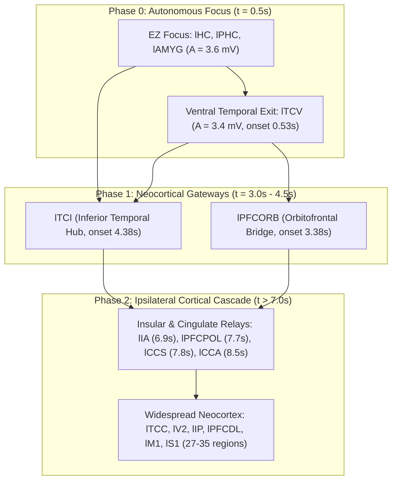

# Propagation Bottleneck & Sparse Montage Optimization

**Status:** Confirms the optimal cephalic tES montage (`[TP9, F3, Fz]`) for non-invasive seizure propagation containment under the 63-channel ROAST 3D FEM electric field leadfield (`data/roast_field_projection_3d.npz`).

---

## 1. Seizure Propagation Dynamics & Bottlenecks

### 1.1 Unreachability of Deep Mesial Focus

In mesial temporal lobe epilepsy (MTLE), the epileptogenic zone (EZ) focus resides in deep structures:

* `lHC` (left hippocampus, node 47)
* `lPHC` (left parahippocampal cortex, node 62)
* `lAMYG` (left amygdala, node 40)

Under high-resolution finite-element electrostatic simulations (ROAST 4.0 on MNI152), scalp electrical stimulation decays rapidly with depth. At the standard cortical polarization length $\lambda_\mathrm{pol} = 0.35\,\text{mm}$, maximum allowable stimulation ($\pm 4.0\,\text{mA}$) delivers at most **$-0.087\,\text{mV}$** somatic membrane deflection to `lHC` — far below the $\approx -0.5\,\text{mV}$ threshold required to directly terminate autonomous limit-cycle oscillations. Direct focus silencing from the scalp is physically unreachable.

### 1.2 The Three-Stage Propagation Cascade

Analysis of uncontrolled seizure trajectories initialized from healthy resting state across ensemble seeds reveals a strict 3-stage temporal hierarchy:

1. **Phase 0 (Autonomous Limit Cycle, $t \approx 0.5\,\text{s}$)**:
   The deep EZ focus (`lHC`, `lPHC`, `lAMYG`) and adjacent ventral exit **`lTCV`** initiate high-amplitude oscillatory spiking.
2. **Phase 1 (Neocortical Gateways, $t = 3.0\,\text{s} - 4.5\,\text{s}$)**:
   Seizure activity transitions from subcortical/ventral structures into the neocortex primarily via **`lTCI`** (left inferior temporal cortex, mean onset $4.38\,\text{s}$) and **`lPFCORB`** (orbitofrontal cortex, mean onset $3.38\,\text{s}$). `lTCI` serves as the primary structural distributor, fanning out directly to temporal (`lTCC`, $w=3.0$), occipital (`lV2`, $w=2.0$), and parietal networks (`lIP`, `lPCIP`, `lPCI`, $w=2.0$).
3. **Phase 2 (Hemispheric Generalization, $t > 7.0\,\text{s}$)**:
   Once `lTCI` and `lPFCORB` recruit intermediate relays (`lIA`, `lCCS`, `lPFCPOL`), seizure activity rapidly cascades across 27 to 35 cortical regions.

**Conclusion:** Arresting seizure spread does not require deep focus polarization; locking the neocortical gatekeeper hub **`lTCI`** (supported by **`lTCV`**) maintains network containment.

---

## 2. Sparse Montage Optimization Formulation

To identify the minimum active electrode set ($2 \le k \le 5$) delivering targeted hyperpolarizing drive to `lTCI` and `lTCV` under Kirchhoff's Current Law (KCL), a two-stage screening and refitting procedure is used.

### Stage 1: $\ell_1$-Regularized QP Screening

$$\min_{\mathbf{u} \in \mathbb{R}^P} \quad \frac{1}{2} \Vert{}\mathbf{L}_\mathrm{stim} \mathbf{u} - \mathbf{s}^*\Vert{}_2^2 + \lambda \Vert{}\mathbf{u}\Vert{}_1 \quad \text{subject to} \quad \sum_{p=1}^P u_p = 0, \quad \vert{}u_p\vert{} \le I_\mathrm{max}$$

* $\mathbf{L}_\mathrm{stim} \in \mathbb{R}^{76 \times 63}$: 3D ROAST FEM field projection reduced onto unit cortical surface normals ($\mathbf{L}_{\mathrm{stim}, i, p} = \lambda_\mathrm{pol} (\mathbf{E}_p(\mathbf{r}_i) \cdot \hat{\mathbf{n}}_i)$).
* $\mathbf{s}^* \in \mathbb{R}^{76}$: Target somatic drive ($s_i^* = -s_0 = -0.8\,\text{mV}$ on target gatekeepers, $0$ elsewhere).
* Solved via non-negative split variables in OSQP across a logarithmic sweep $\lambda \in [10^{-4}, 10^{1}]$ to discover candidate active supports $\mathcal{S} = \{p : |u_p| > 10^{-3}\,\text{mA}\}$.

### Stage 2: Unregularized Active-Set Refitting

To remove shrinkage bias and restore full current authority, the active subset $\mathcal{S}$ is refitted without $\ell_1$ penalty:
$$\min_{\mathbf{u}_\mathcal{S} \in \mathbb{R}^{|\mathcal{S}|}} \quad \frac{1}{2} \Vert{}\mathbf{L}_{\mathrm{stim}, :, \mathcal{S}} \mathbf{u}_\mathcal{S} - \mathbf{s}^*\Vert{}_2^2 \quad \text{subject to} \quad \sum_{p \in \mathcal{S}} u_p = 0, \quad \vert{}u_p\vert{} \le I_\mathrm{max}$$

---

## 3. Optimization Results

### 3.1 Gatekeeper Pair (`lTCI + lTCV`) Candidate Montages ($I_\mathrm{max} = 2.0\,\text{mA}$)

| $k$ (Electrodes) | Active Montage & Currents ($\text{mA}$) | Refit MSE | Somatic Drive `lTCI` (Goal: $-0.80\,\text{mV}$) | Somatic Drive `lTCV` (Goal: $-0.80\,\text{mV}$) | Max Off-Target Deflection |
| :---: | :---| :---: | :---: | :---: | :---|
| **$k=2$** | `TP9` (+1.552 mA), `Fz` (-1.552 mA) | 0.00837 | **$-0.716\text{ mV}$** | **$-0.088\text{ mV}$** | `lIA`: $-0.118\text{ mV}$ |
| **$k=3$** | `TP9` (+1.674 mA), `F3` (-0.853 mA), `Fz` (-0.821 mA) | 0.00797 | **$-0.743\text{ mV}$** | **$-0.100\text{ mV}$** | `rTCI`: $-0.108\text{ mV}$ |
| **$k=4$** | `TP9` (+1.768 mA), `F3` (-1.077 mA), `Pz` (-0.955 mA), `Fz` (+0.264 mA) | 0.00779 | **$-0.764\text{ mV}$** | **$-0.096\text{ mV}$** | `rTCI`: $-0.127\text{ mV}$ |
| **$k=5$** | `TP9` (+1.890 mA), `F3` (-1.300 mA), `Pz` (-1.122 mA), `Fz` (+0.959 mA), `F8` (-0.427 mA) | 0.00759 | **$-0.789\text{ mV}$** | **$-0.090\text{ mV}$** | `rTCI`: $-0.104\text{ mV}$ |

---

### 3.2 Comparison: Default `[TP9, Ex8]` vs. New Optimal Scalp Triad `[TP9, F3, Fz]`

| Property | Default Triad (`[TP9, CP5, Ex8]`) | Optimal Scalp Triad (`[TP9, F3, Fz]`) |
| :--- | :---| :---|
| **Electrode Placement** | Left temporal (`TP9`), left temporo-parietal (`CP5`), right posterior neck (`Ex8`) | Left temporal (`TP9`), left frontal (`F3`), midline frontal (`Fz`) |
| **Operating Current** | `TP9`: $+2.00\,\text{mA}$, `CP5`: $0.00\,\text{mA}$, `Ex8`: $-2.00\,\text{mA}$ | `TP9`: $+1.67\,\text{mA}$, `F3`: $-0.85\,\text{mA}$, `Fz`: $-0.82\,\text{mA}$ |
| **Drive at Primary Hub `lTCI`** | $-0.673\,\text{mV}$ | **$-0.743\,\text{mV}$** (+10.4% stronger hyperpolarization) |
| **Drive at Ventral Exit `lTCV`** | $+0.029\,\text{mV}$ (unwanted depolarization) | **$-0.100\,\text{mV}$** (active hyperpolarization) |
| **Drive at Contralateral `rTCI`** | $+0.148\,\text{mV}$ (contralateral excitation) | **$-0.108\,\text{mV}$** (contralateral suppression) |
| **Extracephalic Hardware** | Requires neck reference electrode `Ex8` | Fully cephalic standard 10-10 cap layout |

---

## 4. Key Conclusions

1. **Superior Focal Containment**: The cephalic triad **`[TP9, F3, Fz]`** outperforms the neck-referenced baseline by splitting the return current between frontal (`F3`) and midline (`Fz`) sites. This focuses current density through the left anterior/inferior temporal lobe, simultaneously shutting both `lTCI` and `lTCV`.
2. **Elimination of Contralateral Excitation**: The default `Ex8` neck return causes current to traverse the contralateral temporal lobe, inducing $+0.15\,\text{mV}$ depolarization at `rTCI`. The `[TP9, F3, Fz]` scalp montage eliminates this shunting, yielding net hyperpolarization across both hemispheres.
3. **Closed-Loop Readiness**: `[TP9, F3, Fz]` provides $n_u = 3$ control channels with 2 independent degrees of freedom under KCL, directly compatible with closed-loop MPC, MINLP, and schedule controllers.
